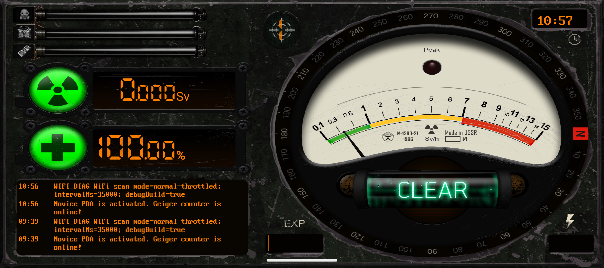
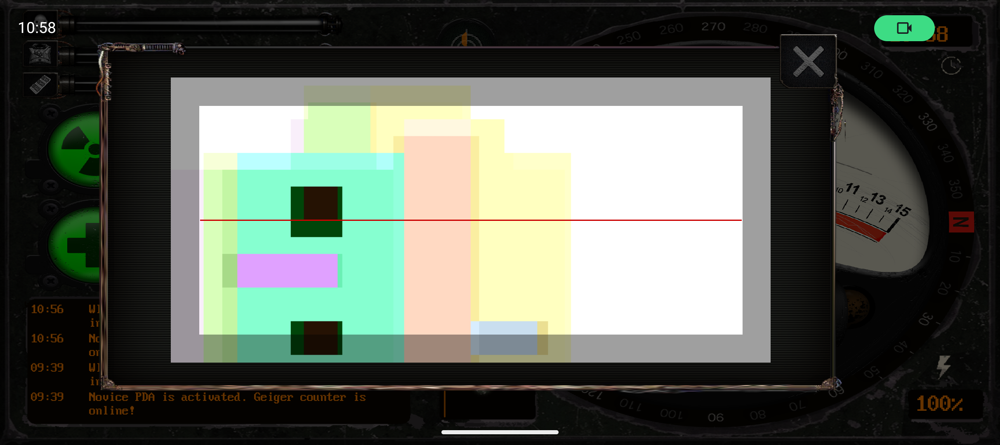
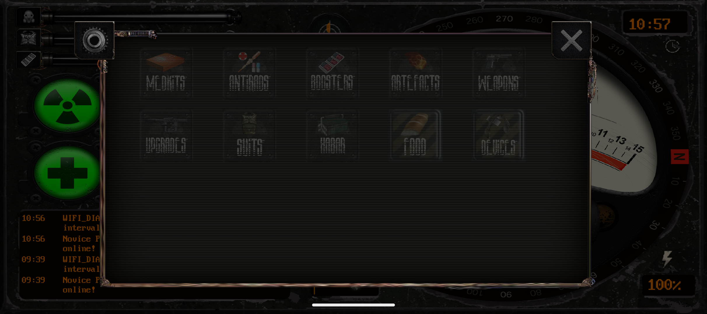
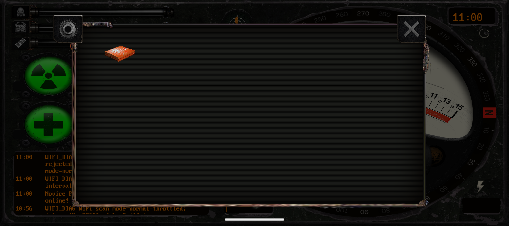
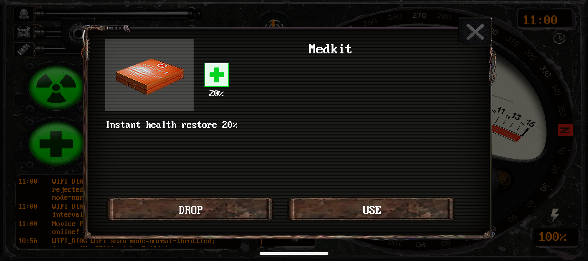
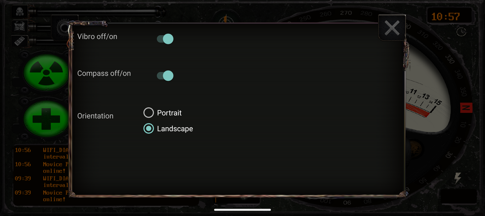

# PDA Compass V3.1: руководство пользователя

Это руководство собрано по восстановленному коду приложения и проверено на Android-эмуляторе. Часть игровых действий зависит от QR-кодов, Wi-Fi/Bluetooth-маячков и сценариев организаторов.

## Назначение приложения

PDA Compass - игровой КПК для stalkerstrike-игр. Он показывает состояние персонажа, принимает игровые события через QR-коды, учитывает инвентарь и реагирует на игровые влияния: радиацию, аномалии, ментальное воздействие, контроллера, бюрера, Монолит, артефакты и выброс.

Приложение использует:

- экран состояния игрока;
- журнал сообщений;
- QR-сканер;
- инвентарь и карточки предметов;
- настройки вибрации, компаса и ориентации;
- датчики телефона и внешние маячки: Wi-Fi, Bluetooth, GPS, батарея, компас.

## Первый запуск

При первом запуске Android может запросить разрешения. Для полноценной работы нужно разрешить:

- геолокацию;
- Bluetooth / Nearby devices;
- Wi-Fi nearby devices, если Android показывает такой запрос;
- камеру;
- уведомления.

Если разрешения не выданы, часть функций будет недоступна: QR-сканер, Wi-Fi/Bluetooth-детекция и foreground service.

## Главный экран



Основные зоны:

- **Левые верхние шкалы** - активные эффекты экипировки: устройство, броня, бустер/стимулятор.
- **Радиационный индикатор** - текущая радиация в `Sv`.
- **Индикатор здоровья** - здоровье персонажа в процентах.
- **Журнал сообщений** - системные и игровые события: уровень PDA, Wi-Fi диагностика, выбросы, получение/использование предметов, смерть и другие состояния.
- **Большая шкала справа** - детектор/компас влияний.
- **Трубка состояния** - центральный индикатор состояния игрока. В нормальном состоянии показывает `CLEAR`.
- **Иконка уровня/QR** сверху ближе к центру - вход в QR-сканер.
- **Часы** - текущее время.
- **Батарея** - заряд телефона.
- **EXP** - прогресс уровня PDA.

## Управление с главного экрана

| Действие | Что делает |
|---|---|
| Долгое нажатие на иконку QR/уровня | Открывает QR-сканер |
| Долгое нажатие на радиационный блок | Открывает полный инвентарь |
| Долгое нажатие на блок здоровья | Открывает полный инвентарь |
| Долгое нажатие на шкалу брони | Открывает активную броню, если она есть |
| Долгое нажатие на шкалу устройства | Открывает активное устройство, если оно есть |
| Долгое нажатие на шкалу бустера | Открывает активный бустер, если он есть |
| Долгое нажатие на трубку состояния | Открывает подтверждение самоубийства, если состояние игрока это допускает |

Короткие нажатия на эти зоны обычно ничего не делают: в коде заложены именно долгие нажатия.

## QR-сканер



QR-сканер используется для игровых кодов:

- получение предметов;
- смена фракции;
- смерть/возрождение по команде организаторов;
- другие события, если они заложены в кодах игры.

Управление в сканере:

- наведите камеру на QR-код;
- после успешного распознавания окно закроется автоматически;
- крестик закрывает сканер вручную;
- свайп влево/вправо переключает камеру;
- свайп вверх/вниз включает или выключает фонарик.

Примеры кодов, найденные в восстановленном коде:

- `monolithknowledgeandlight1` - фракция MONOLITH;
- `supremecreator1` - фракция GAMEMASTER;
- `sampleofradioactivemeat1` - фракция STALKER;
- `DARKEN1` - фракция DARKEN;
- `eblan1` - команда смерти;
- `risefromthedead1` - команда возрождения.

## Инвентарь



Инвентарь открывается долгим нажатием на блок здоровья или радиации.

Категории предметов:

- Weapons;
- Artifacts;
- Boosters;
- Armors;
- Medkits;
- Habar;
- Upgrades;
- Antirads;
- Food;
- Devices.

В верхнем левом углу окна инвентаря есть шестеренка - она открывает настройки PDA. Крестик закрывает окно. Если вы находитесь внутри категории, крестик сначала возвращает к списку категорий.



Нажатие на предмет открывает его карточку.

## Карточка предмета



Карточка показывает:

- изображение предмета;
- название;
- игровые эффекты;
- описание;
- кнопку `DROP`, если предмет можно выбросить;
- кнопку `USE`, если предмет можно использовать.

Кнопки могут скрываться:

- активную броню, активный бустер или активное устройство нельзя выбросить из карточки;
- артефакты не используются кнопкой `USE`;
- нерасходуемые предметы не показывают `USE`.

Типы эффектов на карточке:

- здоровье;
- радиация;
- аномалии;
- ментальное воздействие;
- бюрер;
- контроллер;
- Монолит;
- мгновенное лечение;
- мгновенное снятие радиации.

## Настройки



Настройки открываются через шестеренку в инвентаре.

Доступные параметры:

- **Vibro off/on** - включает или выключает вибрацию.
- **Compass off/on** - включает или выключает компас.
- **Orientation** - переключает ориентацию интерфейса: Portrait или Landscape.

После смены ориентации главный экран перестраивается под выбранный режим.

## Уведомление PDA

Когда приложение работает, оно запускает foreground service и показывает уведомление.

В уведомлении есть две основные команды:

- **PDA Compass v.3.3** - открыть приложение;
- **PDA Off** - остановить сервис приложения.

Если уведомления запрещены в Android, сервис может работать некорректно на новых версиях системы.

## Состояния персонажа

В коде приложения есть следующие состояния:

- `ALIVE` - жив;
- `DEAD_*` - смерть от разных причин;
- `CONTROLLED` - под контролем контроллера;
- `MENTALLED` - ментальное/зомбированное состояние;
- `ABDUCTED` - плен;
- `W_*` - промежуточные состояния ожидания перед итоговым состоянием.

Для некоторых состояний запускается таймер. Например, после аномалии или ментального воздействия приложение может показывать обратный отсчет до итогового состояния.

## Уровни PDA

По сообщениям в коде уровни открывают функции постепенно:

- уровень 1 - Geiger counter;
- уровень 2 - anomaly detector;
- уровень 3 - mental detector;
- уровень 4 - monster anticipating;
- максимальный уровень - artefacts detector.

Прогресс уровня отображается в зоне `EXP`.

## Игровые влияния и аномалии

Приложение рассчитывает воздействия на игрока из нескольких источников:

- Wi-Fi scan results;
- Bluetooth scan results;
- GPS;
- расписание выбросов;
- активные предметы;
- артефакты в инвентаре.

Wi-Fi-маячки сопоставляются по MAC/BSSID из списка организаторов. SSID дополнительно парсится по буквенным маркерам:

| Маркер в SSID | Тип влияния |
|---|---|
| `R` | Radiation |
| `A` | Anomaly |
| `M` | Mental |
| `B` | Burer |
| `C` | Controller |
| `H` | Healing |
| `F` | Artefact |
| `Z` | Monolith |

Число после буквы работает как множитель/порог. Например, `A100` означает аномальное влияние с коэффициентом 100%.

## Wi-Fi-режимы в текущей восстановленной сборке

В новой сборке Wi-Fi-сканирование адаптировано под современные Android.

Обычный режим:

- приложение не спамит `startScan()` каждую секунду;
- активный Wi-Fi scan запрашивается примерно раз в 35 секунд;
- между свежими сканами используются cached results;
- в журнале и `logcat` видны сообщения `WIFI_DIAG`.

Debug 1 Hz режим:

- доступен только в debug APK;
- включается, если в Android Developer Options выключено ограничение поиска Wi-Fi сетей;
- приложение начинает запрашивать Wi-Fi scan раз в секунду.

Ожидаемая диагностика для 1 Hz режима:

```text
WIFI_DIAG WiFi scan mode=debug-1hz; intervalMs=1000; debugBuild=true
```

Обычный режим:

```text
WIFI_DIAG WiFi scan mode=normal-throttled; intervalMs=35000; debugBuild=true
```

Важно: даже в 1 Hz режиме прошивка Android может возвращать cached results. Для проверки свежести смотрите:

```text
WIFI_DIAG event=results source=receiver updated=true
```

`updated=true` означает свежий scan. `updated=false` означает старые cached results.

## Как включить 1 scan/sec на тестовом телефоне

1. Откройте `Настройки`.
2. Откройте `О телефоне`.
3. Нажмите `Номер сборки` 7 раз, чтобы включить режим разработчика.
4. Вернитесь в настройки.
5. Откройте `Для разработчиков`.
6. Найдите пункт `Ограничить поиск сетей Wi-Fi` или `Wi-Fi scan throttling`.
7. Выключите этот пункт.
8. Полностью закройте и снова откройте PDA Compass.

Проверка через ADB:

```powershell
adb shell settings get global wifi_scan_throttle_enabled
```

Значения:

- `0` - ограничение выключено;
- `1` - ограничение включено.

Включить 1 Hz bypass через ADB:

```powershell
adb shell settings put global development_settings_enabled 1
adb shell settings put global wifi_scan_throttle_enabled 0
adb shell am force-stop net.afterday.compas
adb shell am start -n net.afterday.compas/.MainActivity
```

Вернуть стандартное поведение Android:

```powershell
adb shell settings put global wifi_scan_throttle_enabled 1
```

## Советы для игроков

- Не закрывайте приложение во время игры: оно работает через foreground service.
- Не запрещайте геолокацию и nearby devices, иначе Wi-Fi/Bluetooth-детекция может перестать работать.
- Если компас мешает или ведет себя нестабильно, отключите его в настройках.
- Если интерфейс неудобен, переключите ориентацию в настройках.
- Если предмет не используется, проверьте, есть ли у него кнопка `USE`; некоторые предметы пассивные.
- Если предмет активен как броня/устройство/бустер, его нельзя выбросить до окончания действия.

## Советы для организаторов

- Для Wi-Fi-маячков проверяйте MAC/BSSID: приложение сверяет зарегистрированные Wi-Fi-модули по MAC.
- На современных Android не рассчитывайте на стабильный Wi-Fi realtime без отключения `Wi-Fi scan throttling`.
- Для тестов 1 scan/sec используйте debug APK и контролируемые телефоны.
- Для дальнейшего развития лучше переводить realtime-маячки на BLE, сохранив Wi-Fi как legacy fallback.
- Перед игрой проверьте на каждом телефоне: разрешения, уведомление foreground service, `WIFI_DIAG`, QR-сканер и работу инвентаря.

## Известные ограничения восстановленной версии

- Исходники восстановлены из APK, поэтому часть кода сохраняет следы декомпиляции.
- Некоторые игровые данные hardcoded внутри приложения.
- Wi-Fi-аномалии на новых Android зависят от системных ограничений сканирования.
- Интерфейс рассчитан на игровые сценарии и использует скрытые долгие нажатия, а не стандартную навигацию Android.
- Документация описывает поведение текущей восстановленной debug-сборки; после перехода на BLE раздел датчиков нужно обновить.
